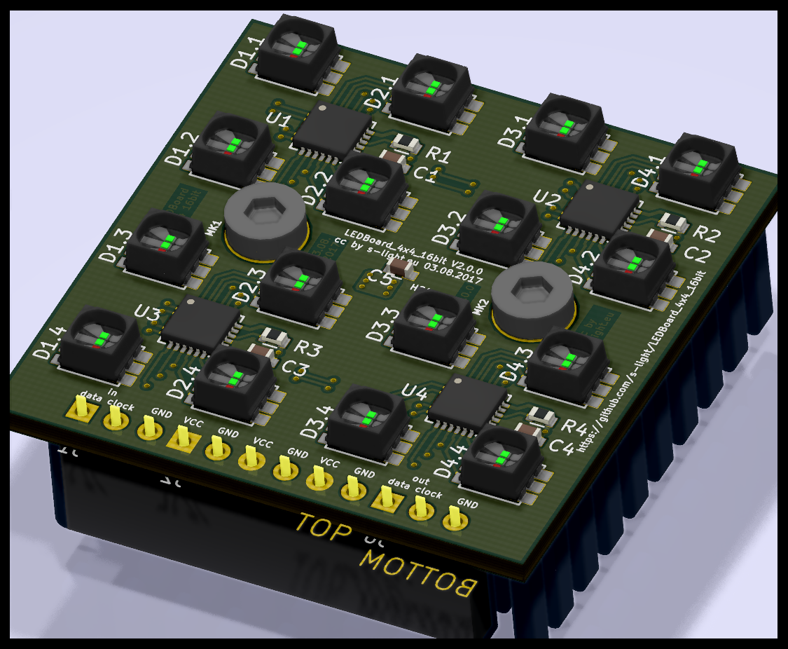

<!--lint disable maximum-line-length-->
<!--lint disable list-item-spacing-->
<!--lint disable list-item-indent-->

# LED-Board 4x4 16bit


a LED-Matrix Board that can be combined seamlessly to bigger areas.  
It uses the [TI TLC5971](http://www.ti.com/product/TLC5971) Constant-Current LED-Driver Chip with 16bit dimming resolution.  

The [original](https://github.com/s-light/LEDBoard_4x4_16bit/tree/Nichia_NSSM032A) LED-footprint was for [Nichia NSSM032A](http://www.nichia.co.jp/en/product/led_product_data.html?type=%27NSSM032A%27) RGB-LED.
Back in 2017 on of the brightest *low power* SMD LEDs in this size -
They are only available as full reel directly from Nichia.

so there is a [second branch](https://github.com/s-light/LEDBoard_4x4_16bit/tree/Nichia_NSSM124D) with the LED-Type changed to [Nichia NSSM124D](http://www.nichia.co.jp/en/product/led_product_data.html?type=%27NSSM124D%27) -
these are [available as cut-tape from an distributor](http://www.leds.de/en/Ordinary-LEDs/SMD-LEDs/Nichia-SMD-LED-RGB-NSSM124DT.html).

latest addition is a [branch with TLC5971*PWP* driver chips](https://github.com/s-light/LEDBoard_4x4_16bit/tree/TLC5971PWP) -
this is the same chip but in an HTSSOP-20 housing -
that is easier to solder by hand.
--> no hot air / reflow oven necessary, but recommend.

## Project-Status
- received first Batch ([Release V1.0.0](https://github.com/s-light/LEDBoard_4x4_16bit/releases/tag/v1.0))
- received second Batch ([Release V3.0.1](https://github.com/s-light/LEDBoard_4x4_16bit/tree/v3.0.1))
- 11 PCB's assembled  
  10 working :sun_with_face:  
  first solder board not working - has a short between VCC and GND (to be checked)
- all needed heavy rework: stencil has to big openings - this gives a bunch of bridges at QFN 0,5mm Pin-Pitch IC's
- had some problems with the first reflow oven used - you need enough heat from the bottom to solder correctly.
- made some picture from first assembly: [gallery](./doc/gallery.md)
- ~~fix pads that are to small for hand-soldering~~ done
- ~~order updated PCB's~~ done
- ~~solder some more boards~~ done (total: ~60)
- ~~order screws at [Wegertseder](https://www.wegertseder.com/ArticleDetails.aspx?AKNUM=2588)~~ done
- updated KiCad files to new version.

### TODO
- order Heat Sink with machining and Thermal Foil from [Fischer Elektronik](http://www.fischerelektronik.de/web_fischer/de_DE/K%C3%BChlk%C3%B6rper/B01/K%C3%BChlk%C3%B6rper%20f%C3%BCr%20PGA/PR/ICKPGA14x14x12_/$productCard/parameters/index.xhtml)
- add some more mounting layouts to [LEDBoard_Layouts](https://github.com/s-light/LEDBoard_Layouts)
- take some more pictures

## Technical Information
there are groups of 4 LEDs that are controlled by one TLC5971.  
every controller chip has 12 ConstantCurrent outputs. so every LED is controllable individual.

you need to create a mapping to linearize the order:  

| X/Y   | 0        | 1        | 2        | 3        |
| :---- | :------- | :------- | :------- | :------- |
| **0** | IC1 LED1 | IC1 LED2 | IC2 LED1 | IC2 LED2 |
| **1** | IC1 LED3 | IC1 LED4 | IC2 LED3 | IC2 LED4 |
| **2** | IC3 LED1 | IC3 LED2 | IC4 LED1 | IC4 LED2 |
| **3** | IC3 LED3 | IC3 LED4 | IC4 LED3 | IC4 LED4 |

example for c++ / arduino
```c++
const uint8_t channel_position_map[4][4] = {
    { 0,  1,  4,  5},
    { 2,  3,  6,  7},
    { 8,  9, 12, 13},
    {10, 11, 14, 15},
};
```

### HW
- PCB size: 40x40x18mm
- pixel-pitch: 10mm
- 3.8V..5.5V
- <= 1A (maximum)

### BOM
there is the raw exported BOM at [export/BOM/LEDBoard_4x4_16bit_BOM.csv](export/BOM/LEDBoard_4x4_16bit_BOM.csv) and an modified LibreOffice Calc file with ordering and Price calculations at [doc/LEDBoard_4x4_16bit_PriceCalculation_Ordering](doc/LEDBoard_4x4_16bit_PriceCalculation_Ordering.csv) (link points to exported csv as preview)

### controlling

#### Micro Controller / Arduino
there are some Arduino Libraries out there that can generate the correct protocol.
My Favorite is [ulrichstern/Tlc59711](https://github.com/ulrichstern/Tlc59711)

i have made a [simple arduino sketch](https://github.com/s-light/LEDBoard_4x4_16bit_HWTest) that uses the mentioned library to test the Boards during production.

#### embedded linux boards
Additionally you can use a embedded Linux board with an SPI output to drive them.
I have successfully implemented the protocol in my fork of OLA.
(TODO: Link and explain OLA setup)

there are also other python libraries out there.
(TODO: test some of theme and link here)

### power & signal connections
theoretically calculate with about 1A@5V for every Board.
Supply Voltage (VCC) should be 3,8V..5,5V - If possible use the lower end. so no extra heat is generated in the driver IC.

for the control-signal there are an input and output 3pin 2,54mm connector:
1. Data
1. Clock
1. GND

for the power there are 3x2pin 2,54mm connector positions.
so you could daisy-chain power also - but be aware the pcb-traces can handle an absolute maximum of 3,5A. So i would recommend only 1 or maximum 2 daisy-chained boards.

## KiCad Version
```text
Application: KiCad

Version: 5.99.0-unknown-652a59b78~104~ubuntu20.04.1, release build

Libraries:
	wxWidgets 3.0.4
	libcurl/7.68.0 OpenSSL/1.1.1f zlib/1.2.11 brotli/1.0.7 libidn2/2.2.0 libpsl/0.21.0 (+libidn2/2.2.0) libssh/0.9.3/openssl/zlib nghttp2/1.40.0 librtmp/2.3

Platform: Linux 5.4.0-48-generic x86_64, 64 bit, Little endian, wxGTK

Build Info:
	Date: Sep 16 2020 10:16:55
	wxWidgets: 3.0.4 (wchar_t,wx containers,compatible with 2.8) GTK+ 3.24
	Boost: 1.71.0
	OCE: 6.9.1
	Curl: 7.68.0
	ngspice: 31
	Compiler: GCC 9.3.0 with C++ ABI 1013

Build settings:
	KICAD_SCRIPTING=ON
	KICAD_SCRIPTING_MODULES=ON
	KICAD_SCRIPTING_PYTHON3=ON
	KICAD_SCRIPTING_WXPYTHON=ON
	KICAD_SCRIPTING_WXPYTHON_PHOENIX=ON
	KICAD_SCRIPTING_ACTION_MENU=ON
	BUILD_GITHUB_PLUGIN=ON
	KICAD_USE_OCE=ON
	KICAD_SPICE=ON

```

## License
<!-- License info -->
<a rel="license" href="http://creativecommons.org/licenses/by/4.0/">
    
</a><br />
<span xmlns:dct="http://purl.org/dc/terms/" property="dct:title">
    LEDBoard_4x4_16bit
</span>
by
<a xmlns:cc="http://creativecommons.org/ns#" href="https://github.com/s-light/LEDBoard_4x4_16bit" property="cc:attributionName" rel="cc:attributionURL">
    Stefan Krüger (s-light)
</a>
is licensed under a
<a rel="license" href="http://creativecommons.org/licenses/by/4.0/">
    Creative Commons Attribution 4.0 International License
</a>.
