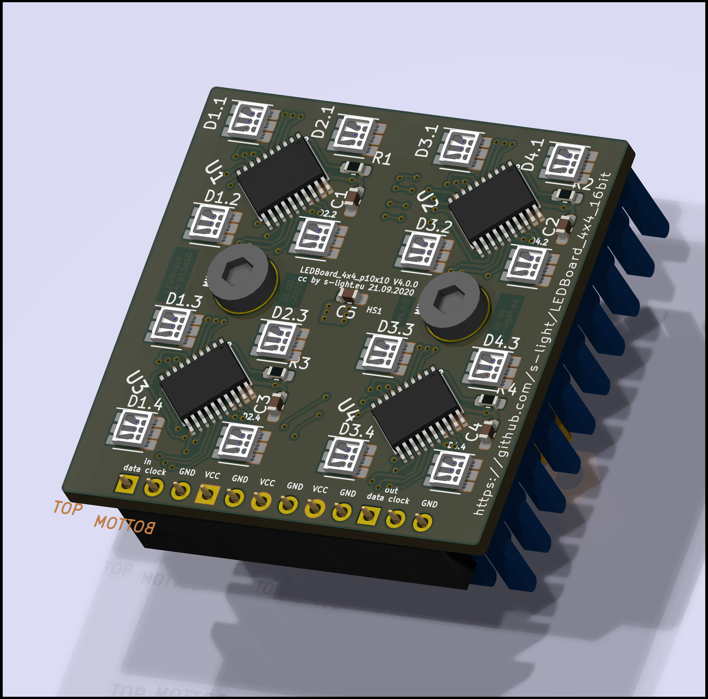

<!--lint disable maximum-line-length-->
<!--lint disable list-item-spacing-->

# LED-Board 4x4 16bit


a LED-Matrix Board that can be combined to bigger areas.  
It uses the [TI TLC5971](http://www.ti.com/product/TLC5971?keyMatch=tlc5971&tisearch=Search-EN-Everything) ConstantCurrent LED-Driver Chip with 16bit dimming resolution.  
The default LED-footprint is for [Nichia NSSM032A](http://www.nichia.co.jp/en/product/led_product_data.html?type=%27NSSM032A%27) RGB-LED

## Project-Status
- received first Batch
- one PCB assembled and tested: working :sun_with_face:  
  hade some problems with the reflow oven - not enough heat from the bottom as the oven only heats from the top.
- made some picture from the assembly process: [gallery](./doc/gallery.md)

### TODO
- solder some more boards
- order screws at [Wegertseder](https://www.wegertseder.com/ArticleDetails.aspx?AKNUM=2588)
- order Heat Sink with machining and Thermal Foil from [Fischer Elektronik](http://www.fischerelektronik.de/web_fischer/de_DE/K%C3%BChlk%C3%B6rper/B01/K%C3%BChlk%C3%B6rper%20f%C3%BCr%20PGA/PR/ICKPGA14x14x12_/$productCard/parameters/index.xhtml)
- add some mounting layouts to [LEDBoard_Layouts](https://github.com/s-light/LEDBoard_Layouts)

### open ideas
- add second branch with other nichia led type

## Technical Information
there are groups of 4 LEDs that are controlled by one TLC5971.  
every controller chip has 12 ConstantCurrent outputs. so every LED is controllable individual.

you need to create a mapping to linearize the order:
**TODO: FILL IN MAPPING INFORMATION**

### HW
- PCB size: 40x40x18mm
- pixel-pitch: 10mm

### BOM
there is the raw exported BOM at [export/BOM/LEDBoard_4x4_16bit_BOM.csv](export/BOM/LEDBoard_4x4_16bit_BOM.csv) and an modified LibreOffice Calc file with ordering and Price calculations at [doc/LEDBoard_4x4_16bit_PriceCalculation_Ordering](doc/LEDBoard_4x4_16bit_PriceCalculation_Ordering.csv) (link points to exported csv as preview)

### controlling

#### Micro Controller / Arduino
there are some Arduino Libraries out there that can generate the correct protocoll.
My Favorit is [ulrichstern/Tlc59711](https://github.com/ulrichstern/Tlc59711)

i have made a [simple arduino sketch](https://github.com/s-light/LEDBoard_4x4_16bit_HWTest) that uses the mentioned library to test the Boards during production.

#### embedded linux boards
Additionally you can use a embedded linux board with an SPI output to drive them.
I have successuflly implemented the protocoll in my fork of OLA.
(TODO: Link and explain OLA setup)

there are also other python libraries out there.
(TODO: test some of theme and link here)

### power & signal connections
theoretically calculate with about 1A@5V for every Board.
Supply Voltage (VCC) should be 3,8V..5,5V - If possible use the lower end. so no extra heat is generated in the driver IC.

for the control-signal there are an input and output 3pin 2,54mm connector:
1. Data
1. Clock
1. GND

for the power there are 3x2pin 2,54mm connector positions.
so you could daisychange power also - but be aware the pcb-traces can handle an absolute maximum of 3,5A. So i would recomend only 1 or maximum 2 daisychangend boards.

## KiCad Version
```text
Application: kicad
Version: no-vcs-found-e797af3~59~ubuntu17.04.1, release build
Libraries: wxWidgets 3.0.2
           libcurl/7.52.1 OpenSSL/1.0.2g zlib/1.2.11 libidn2/0.16 libpsl/0.17.0 (+libidn2/0.16) librtmp/2.3
Platform: Linux 4.10.0-26-generic x86_64, 64 bit, Little endian, wxGTK
- Build Info -
wxWidgets: 3.0.2 (wchar_t,wx containers,compatible with 2.8)
Boost: 1.62.0
Curl: 7.52.1
KiCad - Compiler: GCC 6.3.0 with C++ ABI 1010
        Settings: USE_WX_GRAPHICS_CONTEXT=OFF
                  USE_WX_OVERLAY=OFF
                  KICAD_SCRIPTING=ON
                  KICAD_SCRIPTING_MODULES=ON
                  KICAD_SCRIPTING_WXPYTHON=ON
                  KICAD_SCRIPTING_ACTION_MENU=ON
                  BUILD_GITHUB_PLUGIN=ON
                  KICAD_USE_OCE=ON
```

## License
<!-- License info -->
<a rel="license" href="http://creativecommons.org/licenses/by/4.0/">
    
</a><br />
<span xmlns:dct="http://purl.org/dc/terms/" property="dct:title">
    LEDBoard_4x4_16bit
</span>
by
<a xmlns:cc="http://creativecommons.org/ns#" href="https://github.com/s-light/LEDBoard_4x4_16bit" property="cc:attributionName" rel="cc:attributionURL">
    Stefan Krüger (s-light)
</a>
is licensed under a
<a rel="license" href="http://creativecommons.org/licenses/by/4.0/">
    Creative Commons Attribution 4.0 International License
</a>.
